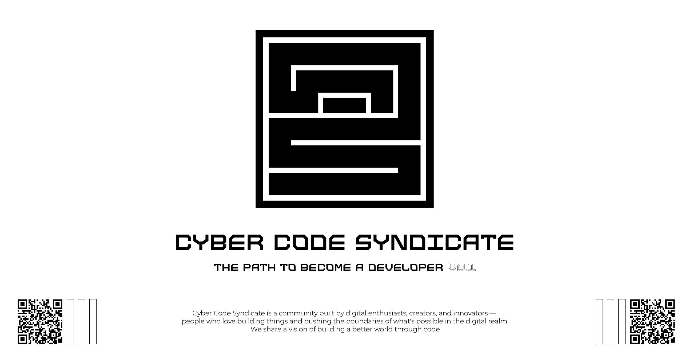

 
<a h ref="https://discord.gg/n4SvjuCBY7 "><a/>
   

  <a id="cover" href="#cover">
    <picture>
      <source media="(prefers-color-scheme: dark)" srcset="github/Cyber_Code_Syndicate_Dark.png">
      
    </picture>
  </a>

